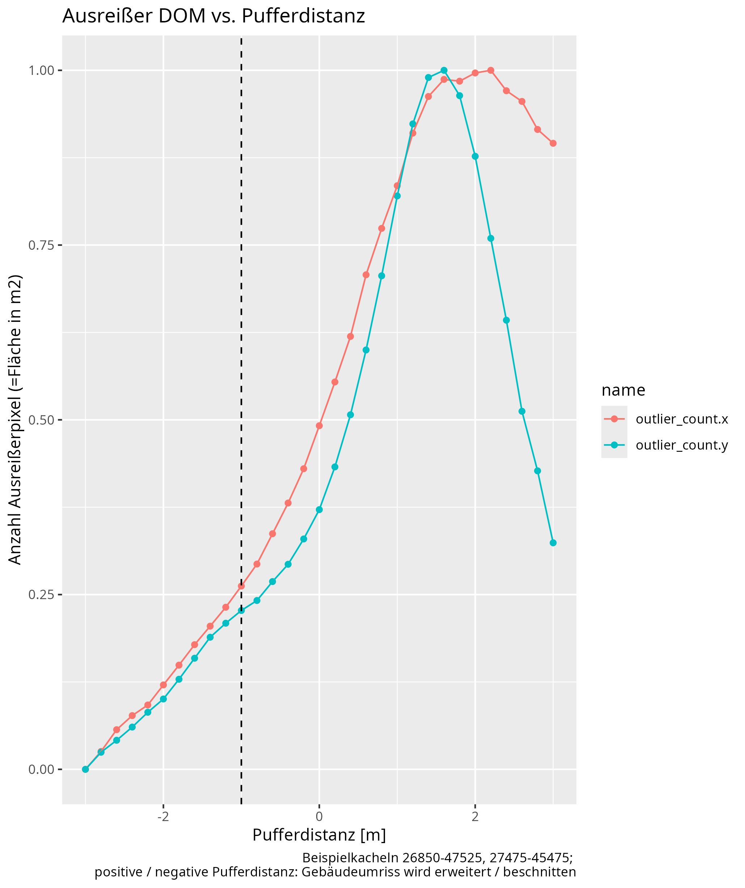
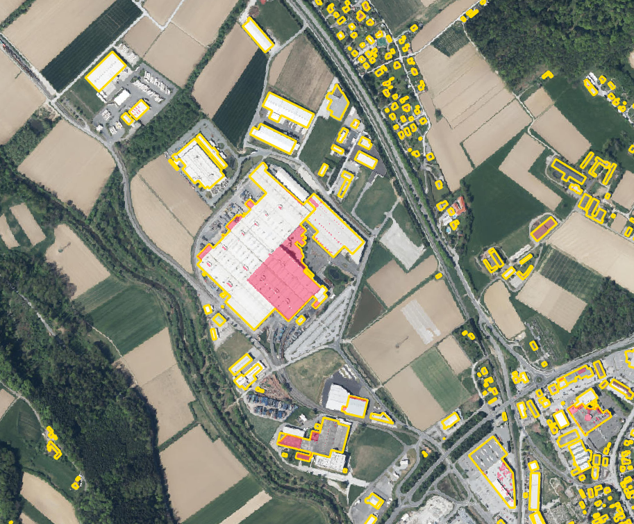
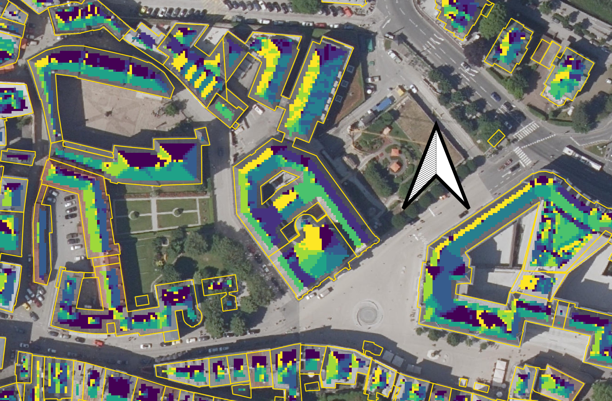

```{r setup, include=FALSE}
knitr::opts_chunk$set(echo = TRUE)
library(nomnoml)
```

# Doku

## Vorbereitungen
- Das Geopackage mit Gebäuden ("Gebäude-DB") wurde von LAEA Europe (EPSG 3035) auf Lambert Austria (EPSG 31287) umprojiziert, um der Projektion der Eingangsraster (DOM, Globalstrahlung) zu entsprechen.

- Durch Verschneidung der Gebäude-DB mit Gemeindepolygonen wurden eine Nachschlagetabelle für die spätere Zuordnung von Gebäuden und Gemeinden (und die Aggregierung auf Gemeindeebene) erstellt.


## Konstanten
Die Liste am Eingang des Hauptskripts `main.R`
enthält alle user servicable parts: Neigungslimit für Flachdächer,
Nutzbarkeitsklassen etc. Die Einstellung der Parameter wird (nur) hier vorgenommen:

```
constants <- list(
  flat = 10,  # Schwellenwert (°), unter dem Dach als flach angenommen wird
  steep = 70, # Schwellenwert (°), oberhalb dessen eine Dachfläche als Kante
  ## bzw. nicht montagetauglich betrachtet wird.
  minsize = 3, # erforderliche Mindestausdehnung zusammenhängender Flächen (Pixel = m²)
  # zusammenhängender Dachfläche
  minbuildings = 3, ## Mindestanzahl an Gebäuden, ab der die Kachel berechnet wird
  a_usable = .7,  # Anteil der für PV nutzbaren Dachfläche (0-1)
  modul_m2 = 2.1,  # Fläche pro Modul [m2]
  pv_e = .18,  # PV efficiency (0-1)
  pv_e_f = \(irr_global) .1898 * irr_global - 3.9931, ## Regression statt Konstante
  st_e = .4,  # ST efficiency (0-1)
  buffer = 0,  # Puffer um Gebäudepolygone [m]; nicht puffern, die Berechnung von Neigung/Aspekt 
  ## entfernt sowieso schon den Zellsaum;
  intervals_solar = c(0, 550, 700, 850, 1000, 1150, Inf), ## Klassen solar
  labels = list(
    aspect = c('N', 'NO', 'O', 'SO', 'S', 'SW', 'W', 'NW'),
    eignung_solar = c('nicht', 'wenig_2040', 'wenig_2020', 'geeignet', 'gut', 'sehr_gut')
    )
)
```
## Methodik

### Workflow
#### Teil 1: von den Eingangsdateien bis zur Hauptmaske
Die in der Gebäude-DB enthaltenen Gebäudegeometrien werden nur für
die jeweils bearbeitete Kachel abgefragt und in ein Raster mit Auflösung
und Projektion der DOM-Kachel umgewandelt. Dieses Raster enthält OBJECTID
und Abgrenzung der Gebäude für die nachfolgenden Berechnungen.

Aus dem DOM wird die Neigung (slope) abgeleitet*, aus der u. a. die Hauptmaske generiert wird. Die Hauptmaske scheidet alle Rasterpixel aus, die bei der Auswertung vernachlässigt werden sollen. Dazu gehören:

- Pixel außerhalb von Gebäuden (Objekten) lt. Gebäude-DB
- Grate: langgezogene, dünne (&le; `minsize` Pixelreihen) mit max. 10° Neigung, wie sie im DOM z. B. durch Dachfirste erzeugt werden
- Inseln: kleine Pixelhaufen, etwa durch Dachaufbauten, mit den Ausscheidungskriterien für Grate
- Kanten oder steile Flächen &gt; `steep` Neigungswinkel 

Mit dieser Hauptmaske werden die übrigen Eingangsdaten maskiert, d. h. ausgeschiedene Pixel werden auf rechnerisch neutral (`NA`) gesetzt.

* Neigung und Aspekt werden aus den 4 orthogonal angrenzenden Pixeln berechnet


```{r, echo=FALSE,  fig.cap = "Workflow, Teil 1", fig.width=7.2}
nomnoml("
#direction: down
  [Raster|1m x 1m]
  [<input>GLO|real]+-[Raster]
  [<input>DOM]+-[Raster]
  [<input>aspect]+-[Raster]
  [<input>slope]+-[Raster]
  [DOM]-->[aspect]
  [DOM]-->[slope]
  [DOM]--[abfragen]
  [<input>slope]
  [<input>aspect]
  [<database>Gebäude-DB] ->
    [<state>abfragen]->
      [<choice>Gebäude?]
  [<choice>Gebäude?] -> [<state>rastern]
  [Gebäude?] nein ->[<end>Ende]
  [rastern] -> [<input>GEB]
  [<input>GLO]
  [GEB] -> [<state>slope beschneiden|auf Gebäude]
  [slope]-[slope beschneiden]
  [slope beschneiden] ->
    [<state>slope bereinigen|Grate (0-10°), Steilfl.
       (> 70°), Inseln (0-10°)
    ] ->
      [<input>Generalmaske]
  [Raster]-> [<state>maskieren]->[<input>Raster maskiert]
  [Generalmaske]--[maskieren]
  [Raster maskiert]->
    [<state>ableiten|pixelweise: effektive Fläche,\n Eignungsklassen ...
    ] ->
      [<state>auslesen|auf Gebäude aggregiert\n(OBJECTID)]
  [auslesen] -> [<input>Tabelle|(ein Datensatz / Gebäude)]  
// notes:
  [<note>aus DOM-Ausdehnung]--[abfragen]
  [<note>nach DOM-Vorlage]--[rastern]
  [<note>image processing,\nnicht GIS:\n?imager::clean]--[slope bereinigen] 
")
```


#### Teil 2: Von den maskierten Eingangsrastern bis zu den Ergebnissen
Mit der oben erstellten Hauptmaske werden die übrigen benötigten Eingangsraster
(Globalstrahlung) und das aus dem DOM abgeleitete Raster "Aspekt" beschnitten.
Die weiteren abgeleiteten Raster (wahre Dachfläche, Eignungsklassen, Dachtyp [
flach/geneigt
]) werden überhaupt aus den bereits maskierten Rastern berechnet, weil dafür
keine Saumpixel mehr benötigt werden (anders als beim Aspekt).
Aus den maskierten Rastern werden die Werte auf Gebäudeebene aggregiert in
Tabellenform (`data.frames`) ausgelesen. Die tabellierten Daten werden samt
Gemeindezugehörigkeit kachelweise als CSV und/oder Excel-Dateien gespeichert und
kachelübergreifend in eine Datenbankdatei (dzt. SQLite) gespeichert. Letzteres
ermöglicht die gemeindeweise Auswertung des Kachelschnitts.

```{r, echo=FALSE, fig.cap="Workflow, Teil 2"}
nomnoml("
#direction: down
  [<database>Objekt-DB]
  [<input>Raster maskiert]->
        [<state>ableiten|pixelweise: effektive Fläche,\n
          Eignungsklassen ...
        ] ->
          [<state>auslesen|auf Gebäude aggregiert\n(OBJECTID)]->
            [<state>umformen] ->
              [<state>joinen|mit Gemeinde-ID]->
                [<state>speichern]
  [Objekt-DB]--[joinen]
  [speichern]->[<database>Ergebnis-DB|(gesamt)]
  [speichern]->[Tabellendatei|(pro Kachel)]
  [speichern]->[GeoTIFFs|(pro Kachel)]
  [Raster maskiert]->[speichern]
  // notes:
  [<note>OBJECTIDs pro Gemeinde \naus Verschneidung\nGebäude-DB und
  Gemeinde-Shapefile]--[Objekt-DB]           
  [<note>immer mit OBJECTID]--[auslesen]           
  [<note>Berechnungen auf Objektebene\n(Tabellenkalkulationen)]--[umformen]   
        
")
```


## Anmerkungen

### Einfluss Pufferdistanz

*obsolet, da Kantenbereinigung jetzt über die Neigung erfolgt*
Bei ca. 1,5 m Puffer (Erweiterung des Gebäudeumrissen treten die meisten Höhen-Ausreißer auf, von da weg nehmen sie rel. linear in beide Richtungen
ab. Eine markante Änderung der Ausreißerzahl bei einer bestimmten Pufferdistanz zur Optimierung der Distanz ist leider nicht erkennbar.)
<!--  -->


### Höhenausreißer
*obsolet (s. o.)*
Die jetzige Ausreißerdefinition würde Flachdächer desselben Gebäudes bei größeren Niveauunterschieden ausscheiden.
<!--  -->


<!-- ### Kontrolle Aspekt -->
<!-- Unterscheidung nach acht Himmelsrichtungen am Beispiel der Domkuppel (Salzburg, Kachel 27475-45475) -->

<!--  -->
